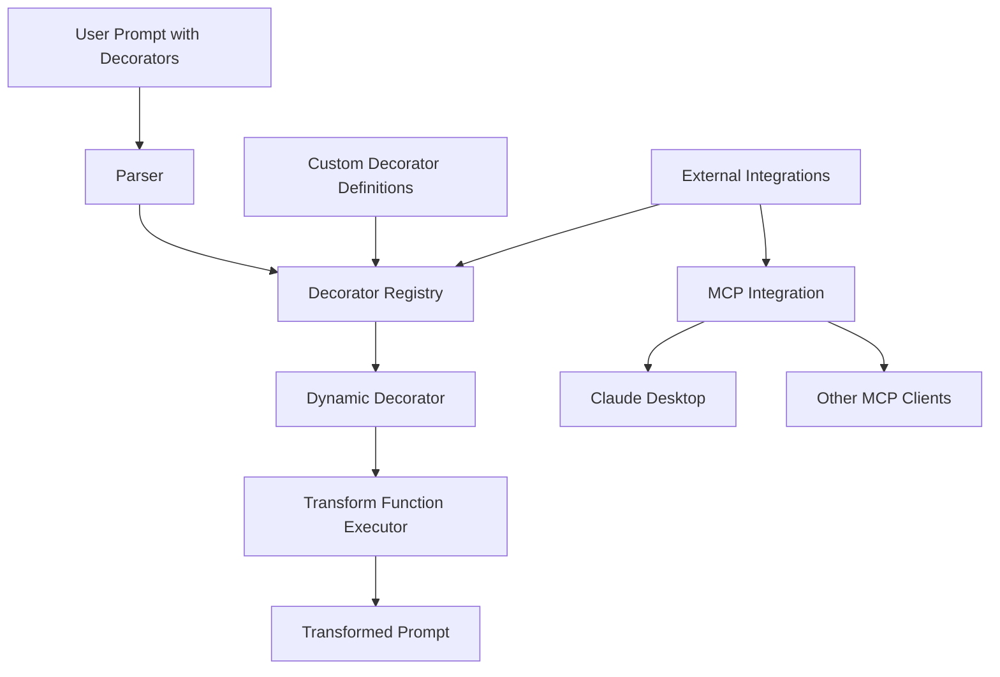

# Architecture

This document provides an overview of the Prompt Decorators framework architecture, explaining its components, design patterns, and how they interact.

## System Overview

The Prompt Decorators framework is designed around a modular architecture that enables dynamic prompt enhancement through a decorator pattern. The system consists of several key components:

1. **Core Decorator Engine**: Handles decorator definition, registration, and application
2. **Dynamic Transformation System**: Processes JavaScript transform functions at runtime
3. **Registry Management**: Maintains a catalog of available decorators
4. **Integration Layer**: Connects with external systems like MCP

## Architectural Diagram



## Key Components

### Core Decorator Engine

The core engine is responsible for the fundamental decorator functionality:

- **DecoratorBase**: Abstract base class that defines the decorator interface
- **DynamicDecorator**: Implementation that handles dynamic decorator behavior
- **Parameter Management**: Handles parameter validation and processing

The engine follows a decorator pattern, allowing decorators to be stacked and composed:

```python
# Example of decorator composition
persona = create_decorator_instance("Persona", role="scientist")
step_by_step = create_decorator_instance("StepByStep", numbered=True)

# Apply decorators in sequence
transformed_prompt = persona(step_by_step(original_prompt))
```

### Dynamic Transformation System

The transformation system executes JavaScript transform functions:

- **JavaScript Engine**: Uses a JavaScript runtime to execute transform functions
- **Context Management**: Provides parameter values to transform functions
- **Error Handling**: Manages errors in transform function execution

Transform functions are defined as JavaScript strings that are evaluated at runtime:

```javascript
// Example transform function
function transform(text) {
  return `Please break down your response into ${numbered ? "numbered" : "clear"} steps.\n\n${text}`;
}
```

### Registry Management

The registry system maintains a catalog of available decorators:

- **Decorator Registry**: Stores decorator definitions
- **Lookup Mechanism**: Retrieves decorators by name
- **Dynamic Loading**: Loads decorators from JSON definitions

The registry allows decorators to be registered and retrieved:

```python
# Register a decorator
register_decorator(my_decorator_def)

# Retrieve a decorator
decorator = get_decorator("MyDecorator")
```

### Integration Layer

The integration layer connects the framework with external systems:

- **MCP Integration**: Implements the Model Context Protocol
- **Tool Definitions**: Exposes decorator functionality as MCP tools
- **Client Adapters**: Adapts to specific client requirements

## Data Flow

The data flow through the system follows these steps:

1. **Input**: User provides a prompt with decorator annotations
2. **Parsing**: The system extracts decorator annotations and parameters
3. **Lookup**: The system retrieves decorator definitions from the registry
4. **Parameter Processing**: Parameters are validated and processed
5. **Transformation**: Transform functions are executed with parameters
6. **Composition**: Multiple transformations are composed
7. **Output**: The transformed prompt is returned

## Design Patterns

The framework employs several design patterns:

### Decorator Pattern

The core functionality uses the decorator pattern to allow stacking and composition of transformations:

```python
# Decorator pattern in action
result = decorator1(decorator2(decorator3(text)))
```

### Factory Pattern

The framework uses a factory pattern to create decorator instances:

```python
# Factory pattern for creating decorators
decorator = create_decorator_instance("DecoratorName", param1="value1")
```

### Registry Pattern

The decorator registry implements the registry pattern:

```python
# Registry pattern for storing and retrieving decorators
register_decorator(decorator_definition)
decorator = get_decorator("DecoratorName")
```

### Strategy Pattern

Transform functions implement the strategy pattern, allowing different transformation strategies:

```python
# Different strategies for transformation
transform_function1 = "return prefix + text;"
transform_function2 = "return text.split('.').join('.\n');"
```

## Extension Points

The framework provides several extension points:

### Custom Decorators

Users can create custom decorators by defining new decorator definitions:

```python
# Define a custom decorator
my_decorator_def = DecoratorDefinition(
    name="MyCustomDecorator",
    description="A custom decorator",
    category="Custom",
    parameters=[...],
    transform_function="..."
)
```

### Integration Adapters

New integrations can be added by implementing adapter classes:

```python
# Implement a new integration adapter
class MyIntegrationAdapter:
    def apply_decorators(self, prompt):
        return apply_dynamic_decorators(prompt)
```

### Transform Function Extensions

The transform function system can be extended with new capabilities:

```python
# Extend the transform function system
js_runtime.add_global("myUtility", my_utility_function)
```

## Performance Considerations

The architecture addresses performance in several ways:

- **Lazy Loading**: Decorators are loaded only when needed
- **Caching**: Frequently used decorators are cached
- **Efficient Parsing**: The parser is optimized for quick extraction
- **Minimal Overhead**: The system adds minimal overhead to prompt processing

## Security Considerations

The architecture includes security measures:

- **Input Validation**: All inputs are validated before processing
- **Sandboxed Execution**: JavaScript is executed in a sandboxed environment
- **Parameter Sanitization**: Parameters are sanitized before use
- **Error Containment**: Errors are contained and don't affect the system

## Deployment Architecture

The framework can be deployed in several configurations:

### Standalone Library

The most common deployment is as a standalone Python library:

```
Application --> Prompt Decorators Library --> LLM Provider
```

### MCP Server

For Claude Desktop and other MCP clients, the framework can be deployed as an MCP server:

```
Claude Desktop --> MCP Protocol --> Prompt Decorators MCP Server --> LLM Provider
```

### Web Service

The framework can be deployed as a web service:

```
Client Applications --> API Gateway --> Prompt Decorators Service --> LLM Providers
```

## Future Architecture Directions

The architecture is designed to evolve in these directions:

- **Plugin System**: A formal plugin system for extensions
- **Distributed Registry**: A distributed registry for sharing decorators
- **Advanced Caching**: More sophisticated caching strategies
- **Cross-Language Support**: Support for other programming languages

## Implementation Details

### Core Module

The `core` module implements the fundamental decorator functionality:

```python
# Base decorator class
class DecoratorBase:
    def __init__(self, **kwargs):
        self.params = kwargs

    def __call__(self, text: str) -> str:
        # Apply the decorator to the text
        return self.transform(text)

    def transform(self, text: str) -> str:
        # To be implemented by subclasses
        raise NotImplementedError
```

### Dynamic Decorator Module

The `dynamic_decorator` module implements the dynamic decorator functionality:

```python
# Dynamic decorator class
class DynamicDecorator(DecoratorBase):
    def __init__(self, name, description, category, parameters, transform_function):
        self.name = name
        self.description = description
        self.category = category
        self.parameters = parameters
        self.transform_function = transform_function
        super().__init__()

    def transform(self, text: str) -> str:
        # Execute the transform function with parameters
        return execute_js(self.transform_function, text, **self.params)
```

### Registry Module

The `registry` module implements the decorator registry:

```python
# Decorator registry
_registry = {}

def register_decorator(definition):
    _registry[definition.name] = definition

def get_decorator(name):
    if name not in _registry:
        raise DecoratorNotFoundError(f"Decorator '{name}' not found")
    return _registry[name]
```

### Parser Module

The `parser` module implements the decorator parsing:

```python
# Decorator parser
def parse_decorators(text):
    # Extract decorator annotations
    pattern = r'\+\+\+([A-Za-z]+)(?:\(([^)]+)\))?'
    matches = re.findall(pattern, text)

    decorators = []
    for name, params_str in matches:
        params = parse_params(params_str)
        decorators.append((name, params))

    # Remove decorator annotations
    clean_text = re.sub(pattern, '', text)

    return decorators, clean_text
```

## Conclusion

The Prompt Decorators architecture provides a flexible, extensible framework for enhancing prompts sent to LLMs. Its modular design allows for easy customization and integration with various systems, while its dynamic implementation enables runtime modification without code generation.

The architecture balances simplicity, performance, and security, making it suitable for a wide range of applications from simple script usage to complex enterprise integrations.
