# Documentation Navigation

This guide helps you navigate the Prompt Decorators documentation to find the information you need quickly.

## Documentation Structure

The Prompt Decorators documentation is organized into several main sections:

1. **Getting Started**: Basic information to get up and running
2. **Tutorials**: Step-by-step guides for common tasks
3. **Integrations**: Information about connecting with other systems
4. **Contributing**: Guidelines for contributing to the project
5. **Project Documentation**: Technical details about the project
6. **Tools**: Documentation for utility tools

## Finding What You Need

### If you're new to Prompt Decorators:

1. Start with the [Home](./index.md) page for an overview
2. Read the [Installation](installation.md) guide to set up the package
3. Follow the [Quick Start](quickstart.md) guide for basic usage
4. Explore [Core Concepts](concepts.md) to understand the framework

### If you want to create decorators:

1. Read [Creating Decorators](creating_decorators.md) for a comprehensive guide
2. Follow the [Creating Custom Decorators](tutorials/creating_custom_decorator.md) tutorial
3. Check the [Validator Tool](validator_tool.md) documentation to validate your decorators

### If you want to use decorators with specific LLMs:

1. Read [Compatibility](compatibility.md) for LLM-specific information
2. Explore the [MCP Integration](integrations/mcp.md) for Claude and other LLMs
3. Check [Claude Desktop](integrations/mcp/claude_desktop.md) for Claude-specific setup

### If you want to contribute to the project:

1. Read the [Contributing Guidelines](contributing.md)
2. Set up your environment using the [Development Setup](development.md) guide
3. Follow the [Development Guide](development_guide.md) for best practices
4. Review the [Documentation Workflow](documentation_workflow.md) for documentation contributions

### If you need technical details:

1. Read the [Architecture](architecture.md) document for system design
2. Check the [Specification](prompt-decorators-specification-v1.0.md) for detailed protocol information
3. Explore the [Code Quality Integration](code_quality_integration.md) for quality standards

## Documentation Map

```mermaid
graph TD
    A[Home] --> B[Getting Started]
    A --> C[Tutorials]
    A --> D[Integrations]
    A --> E[Contributing]
    A --> F[Project Documentation]
    A --> G[Tools]

    B --> B1[Installation]
    B --> B2[Quick Start]
    B --> B3[Core Concepts]
    B --> B4[Creating Decorators]
    B --> B5[Compatibility]

    C --> C1[Creating Custom Decorators]
    C --> C2[Combining Decorators]
    C --> C3[Extension Development]

    D --> D1[Overview]
    D --> D2[Model Context Protocol]
    D2 --> D2A[MCP Server]
    D2 --> D2B[Claude Desktop]

    E --> E1[Guidelines]
    E --> E2[Development Setup]
    E --> E3[Development Guide]
    E --> E4[Documentation]
    E --> E5[Documentation Standards]
    E --> E6[Decorator Registry]

    F --> F1[Roadmap]
    F --> F2[Architecture]
    F --> F3[Specification]
    F --> F4[Code Quality Integration]
    F --> F5[FAQ]
    F --> F6[Glossary]
    F --> F7[Navigation]

    G --> G1[Validator Tool]
    G --> G2[MCP Server]
    G --> G3[Claude Desktop]
    G --> G4[Demoing the Prompt Decorators]
```

## Quick Reference

### Getting Started

- [Installation](installation.md): How to install the package
- [Quick Start](quickstart.md): Basic usage examples
- [Core Concepts](concepts.md): Key concepts and design philosophy
- [Creating Decorators](creating_decorators.md): How to create custom decorators
- [Compatibility](compatibility.md): LLM provider compatibility information

### Tutorials

- [Creating Custom Decorators](tutorials/creating_custom_decorator.md): Step-by-step guide to creating decorators
- [Combining Decorators](tutorials/combining_decorators.md): How to combine multiple decorators
- [Extension Development](tutorials/extension_development.md): Creating decorator extension packages

### Integrations

- [Integrations Overview](integrations/index.md): Overview of available integrations
- [Model Context Protocol (MCP)](integrations/mcp.md): MCP integration details
- [MCP Server](integrations/mcp/server.md): Running the MCP server
- [Claude Desktop](integrations/mcp/claude_desktop.md): Using with Claude Desktop

### Contributing

- [Guidelines](contributing.md): Contribution guidelines
- [Development Setup](development.md): Setting up your development environment
- [Development Guide](development_guide.md): Development best practices
- [Documentation](documentation_workflow.md): Documentation contribution workflow
- [Documentation Standards](DOCSTRING_STANDARDS.md): Standards for documentation
- [Decorator Registry](DECORATOR_REGISTRY.md): Information about the decorator registry

### Project Documentation

- [Roadmap](roadmap.md): Future development plans
- [Architecture](architecture.md): System architecture and design
- [Specification](prompt-decorators-specification-v1.0.md): Detailed technical specification
- [Code Quality Integration](code_quality_integration.md): Code quality tools and processes
- [FAQ](faq.md): Frequently asked questions
- [Glossary](glossary.md): Definitions of key terms
- [Navigation](navigation.md): This navigation guide

### Tools

- [Validator Tool](validator_tool.md): Tool for validating decorator definitions
- [MCP Server](integrations/mcp/server.md): MCP server documentation
- [Claude Desktop](integrations/mcp/claude_desktop.md): Claude Desktop integration
- [Demoing the Prompt Decorators](demo/README.md): Demo tools and examples

## Search Tips

The documentation includes a search feature that can help you find specific information:

1. Use the search box in the top navigation bar
2. Enter keywords related to what you're looking for
3. Press Enter to see search results
4. Click on a result to navigate to that page

Effective search terms include:
- Decorator names (e.g., "StepByStep", "Reasoning")
- Concepts (e.g., "parameters", "transform function")
- Tasks (e.g., "create decorator", "combine decorators")
- Integration names (e.g., "Claude", "MCP")

## Additional Resources

- [GitHub Repository](https://github.com/synaptiai/prompt-decorators): Source code and issue tracking
- [PyPI Package](https://pypi.org/project/prompt-decorators/): Package information
- [Release Notes](https://github.com/synaptiai/prompt-decorators/releases): Version history and changes

## Feedback

If you can't find what you're looking for or have suggestions for improving the documentation:

1. [Open an issue](https://github.com/synaptiai/prompt-decorators/issues/new) on GitHub
2. Specify what information you were looking for
3. Suggest where you would expect to find it

Your feedback helps us improve the documentation for everyone!
