# Intent-to-Decorator: LLM-Based Intent Analysis Architecture

## Executive Summary

Intent-to-Decorator is an intelligent system within the prompt-decorators framework that automatically selects and applies appropriate decorators to user prompts by leveraging LLMs to analyze user intent. This self-improving system creates a feedback loop where decorator effectiveness for specific intents improves over time, providing an increasingly personalized experience while maintaining transparency and user control.

## Domain Model

### Bounded Contexts

The architecture is organized into four bounded contexts, each with distinct responsibilities and domain models:

1. **Intent Analysis Context**: Responsible for analyzing user queries and determining user intent
2. **Decorator Selection Context**: Matches intents to appropriate decorators
3. **Learning Context**: Records and processes effectiveness feedback
4. **MCP Integration Context**: Interfaces with the Model Context Protocol system

```mermaid
graph TB
    subgraph "Intent Analysis Context"
        IA[IntentAnalyzer] --> |analyzes| Q[Query]
        IA --> |produces| IT[IntentType]
        IT --> |triggers| IAE[IntentAnalyzed]
    end

    subgraph "Decorator Selection Context"
        DM[DecoratorMatcher] --> |uses| IT
        DM --> |produces| DS[DecoratorSelection]
        DS --> |creates| EP[EnhancedPrompt]
        DS --> |triggers| DSE[DecoratorsSelected]
    end

    subgraph "Learning Context"
        ER[EffectivenessRecord] --> |aggregates into| IDM[IntentDecoratorMapping]
        FS[FeedbackScore] --> |updates| ER
        MR[MappingRepository] --> |persists| IDM
        FS --> |triggers| FRE[FeedbackRecorded]
    end

    subgraph "MCP Integration Context"
        MPE[McpPromptEnhancer] --> |adapts| EP
        MM[McpMetadata] --> |describes| EP
        MG[MetadataGenerator] --> |produces| MM
    end

    IT -.-> DM
    EP -.-> MPE
    DSE -.-> MPE
    FRE -.-> IDM
    IAE -.-> DSE
```



### Core Domain Objects

#### Intent Analysis Context

| Type | Name | Description |
|------|------|-------------|
| Entity | `IntentAnalysis` | The result of analyzing a user query |
| Value Object | `IntentType` | Categorization of user intent (e.g., comparison, explanation, code review) |
| Service | `IntentAnalyzer` | Service that analyzes text to determine intent |
| Domain Event | `IntentAnalyzed` | Event triggered when a new intent is analyzed |

#### Decorator Selection Context

| Type | Name | Description |
|------|------|-------------|
| Entity | `DecoratorSelection` | A set of decorators chosen for a specific query |
| Value Object | `DecoratorConfiguration` | A decorator with its parameters |
| Service | `DecoratorMatcher` | Matches intents to appropriate decorators |
| Aggregate | `EnhancedPrompt` | Combines the original prompt with selected decorators |
| Domain Event | `DecoratorsSelected` | Event triggered when decorators are selected |

#### Learning Context

| Type | Name | Description |
|------|------|-------------|
| Entity | `EffectivenessRecord` | Record of decorator effectiveness for an intent |
| Value Object | `FeedbackScore` | User rating of response quality |
| Aggregate | `IntentDecoratorMapping` | Collection of decorator effectiveness scores for an intent |
| Repository | `MappingRepository` | Stores and retrieves intent-decorator mappings |
| Domain Event | `FeedbackRecorded` | Event triggered when user feedback is received |

#### MCP Integration Context

| Type | Name | Description |
|------|------|-------------|
| Service | `McpPromptEnhancer` | Adapts the enhanced prompt to MCP format |
| Value Object | `McpMetadata` | Metadata about applied decorators for MCP client |
| Service | `MetadataGenerator` | Generates detailed metadata about the prompt enhancement |

## Strategic Design

### System Architecture

The Intent-to-Decorator system uses a layered architecture incorporating:

1. **Application Layer**: Orchestrates the use cases for intent analysis and decorator application
2. **Domain Layer**: Contains the core domain models and business logic
3. **Infrastructure Layer**: Provides technical capabilities including LLM integration and storage


### Learning System

The learning system is a crucial component that allows the Intent-to-Decorator architecture to improve over time based on user feedback. It implements a feedback loop that adjusts decorator selection based on effectiveness ratings.

```python
import json
import os
import time
from typing import Dict, List, Optional, Any, Set, Union
import aiofiles
from dataclasses import dataclass, asdict

@dataclass
class DecoratorEffectivenessScore:
    """Stores the effectiveness score of a decorator for a specific intent."""
    decorator: str  # Full decorator string including parameters
    score: float    # 1.0 to 5.0
    usageCount: int # How many times this decorator has been used

class MappingRepository:
    """Repository for storing and retrieving intent-decorator mappings."""

    def __init__(self, storage_path: str, storage_type: str = "file"):
        self.storage_path = storage_path
        self.storage_type = storage_type

    async def get_mappings(self) -> Optional[Dict[str, List[Dict[str, Any]]]]:
        """Retrieve mappings from storage."""
        if self.storage_type == "file":
            return await self._load_from_file()
        else:
            # Could be extended to support database storage, cloud storage, etc.
            raise NotImplementedError(f"Storage type {self.storage_type} not implemented")

    async def save_mappings(self, mappings: Dict[str, List[Dict[str, Any]]]) -> None:
        """Save mappings to storage."""
        if self.storage_type == "file":
            await self._save_to_file(mappings)
        else:
            raise NotImplementedError(f"Storage type {self.storage_type} not implemented")

    async def _load_from_file(self) -> Optional[Dict[str, List[Dict[str, Any]]]]:
        """Load mappings from a JSON file."""
        try:
            if not os.path.exists(self.storage_path):
                return None

            async with aiofiles.open(self.storage_path, "r") as f:
                content = await f.read()
                if not content:
                    return None

                return json.loads(content)
        except Exception as e:
            import logging
            logging.error(f"Error loading mappings: {str(e)}")
            return None

    async def _save_to_file(self, mappings: Dict[str, List[Dict[str, Any]]]) -> None:
        """Save mappings to a JSON file."""
        try:
            # Ensure directory exists
            os.makedirs(os.path.dirname(self.storage_path), exist_ok=True)

            async with aiofiles.open(self.storage_path, "w") as f:
                await f.write(json.dumps(mappings, indent=2))
        except Exception as e:
            import logging
            logging.error(f"Error saving mappings: {str(e)}")

class AdaptiveDecoratorMapping:
    """Manages learned mappings between user intents and effective decorators."""

    def __init__(self, repository: MappingRepository, learning_rate: float = 0.1):
        self.repository = repository
        self.learning_rate = learning_rate
        self.mappings: Dict[str, List[DecoratorEffectivenessScore]] = {}
        self.is_loaded = False

    async def load_mappings(self) -> None:
        """Load mappings from the repository."""
        if self.is_loaded:
            return

        raw_mappings = await self.repository.get_mappings()

        if raw_mappings:
            for intent, scores in raw_mappings.items():
                self.mappings[intent] = [
                    DecoratorEffectivenessScore(
                        decorator=s["decorator"],
                        score=s["score"],
                        usageCount=s["usageCount"]
                    )
                    for s in scores
                ]

        self.is_loaded = True

    async def save_mappings(self) -> None:
        """Save mappings to the repository."""
        serialized_mappings = {}

        for intent, scores in self.mappings.items():
            serialized_mappings[intent] = [asdict(s) for s in scores]

        await self.repository.save_mappings(serialized_mappings)

    async def record_feedback(
        self,
        intent: str,
        decorators: List[str],
        rating: float,
        user_id: Optional[str] = None
    ) -> None:
        """Record feedback on decorator effectiveness."""
        if not self.is_loaded:
            await self.load_mappings()

        if intent not in self.mappings:
            self.mappings[intent] = []

        intent_mappings = self.mappings[intent]

        # Update scores for each decorator
        for decorator in decorators:
            existing_score = next((s for s in intent_mappings if s.decorator == decorator), None)

            if existing_score:
                # Update existing score with exponential moving average
                # This weighs recent feedback while preserving historical data
                existing_score.score = (1 - self.learning_rate) * existing_score.score + self.learning_rate * rating
                existing_score.usageCount += 1
            else:
                # Add new score
                intent_mappings.append(DecoratorEffectivenessScore(
                    decorator=decorator,
                    score=rating,
                    usageCount=1
                ))

        # Sort by score
        self.mappings[intent] = sorted(intent_mappings, key=lambda s: s.score, reverse=True)

        # Save updated mappings
        await self.save_mappings()

    def get_recommended_decorators(
        self,
        intent: str,
        count: int = 3,
        min_usage: int = 5
    ) -> List[str]:
        """Get recommended decorators for an intent."""
        if intent not in self.mappings:
            return []  # No recommendations yet

        # Filter by minimum usage to ensure statistical significance
        qualified_scores = [s for s in self.mappings[intent] if s.usageCount >= min_usage]

        # If no decorators have enough usage data, fall back to all decorators
        if not qualified_scores and self.mappings[intent]:
            qualified_scores = self.mappings[intent]

        return [score.decorator for score in qualified_scores[:count]]

    def get_decorator_confidence(self, intent: str, decorator: str) -> float:
        """Get confidence score for a specific decorator for an intent."""
        if intent not in self.mappings:
            return 0.0

        for score in self.mappings[intent]:
            if score.decorator == decorator:
                # Normalize score to 0-1 range and factor in usage count
                # More usage = higher confidence
                usage_factor = min(score.usageCount / 10, 1.0)  # Cap at 10 usages
                return (score.score / 5.0) * 0.7 + usage_factor * 0.3

        return 0.0

class FeedbackCollector:
    """Collects and processes user feedback on decorator effectiveness."""

    def __init__(self, mapping: AdaptiveDecoratorMapping):
        self.mapping = mapping

    async def process_feedback(
        self,
        intent: str,
        decorators: List[str],
        rating: float,
        user_id: Optional[str] = None,
        metadata: Optional[Dict[str, Any]] = None
    ) -> None:
        """Process feedback from user."""
        # Validate rating
        normalized_rating = max(1.0, min(5.0, rating))

        # Record feedback
        await self.mapping.record_feedback(
            intent=intent,
            decorators=decorators,
            rating=normalized_rating,
            user_id=user_id
        )

        # Could add analytics, telemetry, etc. here
        self._log_feedback(intent, decorators, normalized_rating, metadata)

    def _log_feedback(
        self,
        intent: str,
        decorators: List[str],
        rating: float,
        metadata: Optional[Dict[str, Any]] = None
    ) -> None:
        """Log feedback for analytics purposes."""
        import logging

        log_data = {
            "intent": intent,
            "decorators": decorators,
            "rating": rating,
            "timestamp": time.time()
        }

        if metadata:
            log_data["metadata"] = metadata

        logging.info(f"Feedback recorded: {json.dumps(log_data)}")
```

The learning system provides a robust mechanism for capturing and utilizing user feedback, with the following key features:

1. **Exponential Moving Average**: Recent ratings influence decorator scores but don't completely override historical data, providing stability over time.

2. **Usage Tracking**: The system tracks how many times each decorator is used, prioritizing decorators with more usage data.

3. **Confidence Scoring**: Confidence scores combine rating quality and usage quantity, ensuring both factors contribute to overall confidence.

4. **Persistence**: Mappings are stored in a repository with flexible storage backends, allowing for different deployment scenarios.

### MCP Integration

The MCP (Model Context Protocol) integration layer adapts our internal domain models to the MCP format required by the client, enabling seamless communication with LLM providers.

```python
from typing import Dict, List, Optional, Any
from dataclasses import dataclass, asdict
import json

@dataclass
class McpMetadata:
    """Metadata about applied decorators for MCP client."""
    appliedDecorators: List[Dict[str, Any]]
    detectedIntent: Dict[str, Any]
    userOverrides: Optional[Dict[str, List[str]]] = None

class McpPromptEnhancer:
    """Adapts the enhanced prompt to MCP format."""

    def enhance_prompt(
        self,
        query: str,
        decorators: DecoratorSelection,
        intent_analysis: IntentAnalysisResult
    ) -> Dict[str, Any]:
        """Enhance the prompt for MCP and generate metadata."""
        # Generate the enhanced query text with decorators
        enhanced_query = self._apply_decorators_to_query(query, decorators.decorators)

        # Generate metadata for the client
        metadata = self._generate_metadata(decorators, intent_analysis)

        # Return the enhanced prompt in MCP format
        return {
            "prompt": enhanced_query,
            "metadata": asdict(metadata)
        }

    def _apply_decorators_to_query(
        self,
        query: str,
        decorators: List[DecoratorConfiguration]
    ) -> str:
        """Apply decorators to the query text."""
        # Format each decorator
        decorator_strings = []

        for decorator in decorators:
            params_str = ""
            if decorator.parameters:
                params = []
                for name, param in decorator.parameters.items():
                    params.append(f"{name}={param.value}")
                params_str = f"({', '.join(params)})"

            decorator_strings.append(f"+++{decorator.name}{params_str}")

        # Add decorators at the beginning, each on a new line
        if decorator_strings:
            return "\n".join(decorator_strings) + "\n" + query
        else:
            return query

    def _generate_metadata(
        self,
        decorators: DecoratorSelection,
        intent_analysis: IntentAnalysisResult
    ) -> McpMetadata:
        """Generate metadata about the applied decorators."""
        # Format decorator information
        applied_decorators = []

        for decorator in decorators.decorators:
            applied_decorators.append({
                "name": decorator.name,
                "parameters": {name: param.value for name, param in decorator.parameters.items()},
                "source": decorator.source,
                "confidence": decorator.confidence
            })

        # Format intent information
        intent_data = {
            "primary": intent_analysis.primary_intent.value,
            "confidence": intent_analysis.confidence
        }

        if intent_analysis.secondary_intents:
            intent_data["secondary"] = [intent.value for intent in intent_analysis.secondary_intents]

        # Create metadata
        return McpMetadata(
            appliedDecorators=applied_decorators,
            detectedIntent=intent_data
        )

    def apply_user_overrides(
        self,
        prompt_data: Dict[str, Any],
        added_decorators: List[str],
        removed_decorators: List[str]
    ) -> Dict[str, Any]:
        """Apply user overrides to the prompt and metadata."""
        if not added_decorators and not removed_decorators:
            return prompt_data

        # Parse the current prompt
        lines = prompt_data["prompt"].split("\n")

        # Identify decorator lines vs. content
        decorator_lines = []
        content_start = 0

        for i, line in enumerate(lines):
            if line.startswith("+++"):
                decorator_lines.append(line)
                content_start = i + 1
            else:
                break

        # Get the content (everything after decorators)
        content = "\n".join(lines[content_start:])

        # Apply removals (filter out decorators to remove)
        current_decorators = []
        for line in decorator_lines:
            decorator_name = line.split("(")[0][3:] if "(" in line else line[3:]
            if decorator_name not in removed_decorators:
                current_decorators.append(line)

        # Apply additions
        for decorator in added_decorators:
            current_decorators.append(f"+++{decorator}")

        # Reconstruct the prompt
        enhanced_prompt = "\n".join(current_decorators + [content])

        # Update metadata
        metadata = prompt_data["metadata"]
        if not metadata.get("userOverrides"):
            metadata["userOverrides"] = {}

        metadata["userOverrides"]["addedDecorators"] = added_decorators
        metadata["userOverrides"]["removedDecorators"] = removed_decorators

        # Return updated prompt data
        return {
            "prompt": enhanced_prompt,
            "metadata": metadata
        }

class MetadataGenerator:
    """Generates detailed metadata about the prompt enhancement."""

    def generate_decorator_explanations(
        self,
        decorators: List[DecoratorConfiguration],
        intent: IntentAnalysisResult
    ) -> Dict[str, str]:
        """Generate explanations for why each decorator was selected."""
        explanations = {}

        intent_type = intent.primary_intent.value

        # Common explanation patterns based on intent type
        explanation_templates = {
            "explanation": {
                "Reasoning": "Provides structured reasoning paths to explain concepts thoroughly",
                "StepByStep": "Breaks down explanations into clear sequential steps",
                "Layered": "Structures explanation in progressive layers of complexity"
            },
            "comparison": {
                "Compare": "Presents a structured comparison of the items",
                "DecisionMatrix": "Evaluates items across multiple criteria in matrix format",
                "TableFormat": "Organizes comparison data in a clear tabular format"
            },
            # Add templates for other intent types
        }

        # Generate explanations for each decorator
        for decorator in decorators:
            # Use template if available
            if (intent_type in explanation_templates and
                decorator.name in explanation_templates[intent_type]):
                explanations[decorator.name] = explanation_templates[intent_type][decorator.name]
            else:
                # Generic explanation based on source
                if decorator.source == "rule":
                    explanations[decorator.name] = f"Applied based on best practices for {intent_type} queries"
                elif decorator.source == "learning":
                    explanations[decorator.name] = f"Recommended based on positive feedback for similar {intent_type} queries"
                else:
                    explanations[decorator.name] = "Applied by user selection"

        return explanations
```

The MCP integration layer handles the critical task of transforming our domain objects into the protocol format expected by the MCP client:

1. **Prompt Enhancement**: Formats decorators and applies them to the original query in the proper syntax.

2. **Metadata Generation**: Creates detailed metadata about decorators, intents, and confidence levels for transparency.

3. **User Overrides**: Supports user modifications to the automatically selected decorators, preserving agency and control.

4. **Decorator Explanations**: Generates human-readable explanations for why each decorator was selected, enhancing transparency.

### Prompt Enhancement Pipeline

The prompt enhancement pipeline orchestrates the entire decorator selection and application process:

```python
from typing import Dict, List, Optional, Any, Tuple
import logging

class PromptEnhancementPipeline:
    """Orchestrates the process of analyzing intent and enhancing prompts with decorators."""

    def __init__(
        self,
        intent_analyzer: IntentAnalyzer,
        rule_matcher: RuleBasedDecoratorMatcher,
        learning_matcher: Optional[LearningBasedDecoratorMatcher] = None,
        mcp_enhancer: McpPromptEnhancer = None,
        learning_enabled: bool = True,
        max_decorators: int = 4
    ):
        self.intent_analyzer = intent_analyzer
        self.rule_matcher = rule_matcher
        self.learning_matcher = learning_matcher
        self.mcp_enhancer = mcp_enhancer or McpPromptEnhancer()
        self.learning_enabled = learning_enabled
        self.max_decorators = max_decorators
        self.logger = logging.getLogger("PromptEnhancementPipeline")

    async def enhance_prompt(self, query: str) -> Dict[str, Any]:
        """
        Analyze the query, select appropriate decorators, and enhance the prompt.

        Returns:
            A dictionary containing the enhanced prompt and metadata.
        """
        try:
            # Step 1: Analyze intent
            self.logger.info(f"Analyzing intent for query: {query[:50]}...")
            intent = await self.intent_analyzer.analyze_intent(query)

            # Step 2: Get rule-based decorators
            self.logger.info(f"Getting rule-based decorators for intent: {intent.primary_intent.value}")
            rule_decorators = await self.rule_matcher.get_decorators_for_intent(intent, query)

            # Step 3: Get learning-based decorators if enabled
            learning_decorators = None
            if self.learning_enabled and self.learning_matcher:
                self.logger.info("Getting learning-based decorators")
                learning_decorators = await self.learning_matcher.get_decorators_for_intent(intent, query)

            # Step 4: Combine and select final decorators
            final_decorators = await self._combine_decorator_selections(
                rule_decorators,
                learning_decorators
            )

            # Step 5: Enhance prompt with selected decorators
            self.logger.info(f"Enhancing prompt with {len(final_decorators.decorators)} decorators")
            enhanced_prompt = self.mcp_enhancer.enhance_prompt(query, final_decorators, intent)

            # Step 6: Add explanation metadata
            enhanced_prompt["rationale"] = self._generate_selection_rationale(
                final_decorators,
                intent
            )

            return enhanced_prompt

        except Exception as e:
            self.logger.error(f"Error enhancing prompt: {str(e)}", exc_info=True)
            # Return original query in case of error
            return {
                "prompt": query,
                "metadata": {
                    "error": f"Prompt enhancement failed: {str(e)}",
                    "originalQuery": query
                }
            }

    async def _combine_decorator_selections(
        self,
        rule_selection: DecoratorSelection,
        learning_selection: Optional[DecoratorSelection]
    ) -> DecoratorSelection:
        """Combine rule-based and learning-based decorator selections."""
        # If learning is not enabled or no learning results
        if not learning_selection:
            # Limit to max_decorators
            if len(rule_selection.decorators) > self.max_decorators:
                return DecoratorSelection(
                    decorators=rule_selection.decorators[:self.max_decorators],
                    resolved_conflicts=rule_selection.resolved_conflicts +
                        [f"Limited to {self.max_decorators} decorators"]
                )
            return rule_selection

        # Combine both selections, prioritizing by confidence
        all_decorators = []
        seen_names = set()

        # First add high-confidence learning decorators
        for decorator in learning_selection.decorators:
            if decorator.confidence and decorator.confidence > 0.7:
                all_decorators.append(decorator)
                seen_names.add(decorator.name)

        # Then add rule-based decorators not already added
        for decorator in rule_selection.decorators:
            if decorator.name not in seen_names:
                all_decorators.append(decorator)
                seen_names.add(decorator.name)

        # Then add remaining learning decorators
        for decorator in learning_selection.decorators:
            if decorator.name not in seen_names:
                all_decorators.append(decorator)
                seen_names.add(decorator.name)

        # Sort by confidence
        sorted_decorators = sorted(
            all_decorators,
            key=lambda d: d.confidence if d.confidence else 0.5,
            reverse=True
        )

        # Limit to max_decorators
        final_decorators = sorted_decorators[:self.max_decorators]

        # Check compatibility of combined selection
        is_compatible, conflicts = self.rule_matcher.check_decorator_compatibility(final_decorators)

        if not is_compatible:
            # Resolve conflicts
            final_decorators, resolved = self.rule_matcher._resolve_conflicts(final_decorators, conflicts)

            return DecoratorSelection(
                decorators=final_decorators,
                resolved_conflicts=resolved +
                    learning_selection.resolved_conflicts +
                    rule_selection.resolved_conflicts
            )

        return DecoratorSelection(
            decorators=final_decorators,
            resolved_conflicts=learning_selection.resolved_conflicts + rule_selection.resolved_conflicts
        )

    def _generate_selection_rationale(
        self,
        selection: DecoratorSelection,
        intent: IntentAnalysisResult
    ) -> Dict[str, Any]:
        """Generate rationale for the decorator selection."""
        # Generate a metadata generator if not already provided
        metadata_generator = MetadataGenerator()

        # Get explanations for each decorator
        explanations = metadata_generator.generate_decorator_explanations(
            selection.decorators,
            intent
        )

        # Create a summary of the selection process
        # including conflicts that were resolved
        selection_process = {
            "intent": {
                "primary": intent.primary_intent.value,
                "confidence": intent.confidence,
                "secondary": [i.value for i in intent.secondary_intents] if intent.secondary_intents else []
            },
            "decoratorCount": len(selection.decorators),
            "explanations": explanations,
            "resolvedConflicts": selection.resolved_conflicts
        }

        return selection_process
```

The prompt enhancement pipeline brings everything together:

1. **Orchestration**: Coordinates all components in the correct sequence
2. **Error Handling**: Robust error handling to ensure graceful fallbacks
3. **Combination Logic**: Intelligent algorithm for combining rule-based and learning-based decorators
4. **Selection Rationale**: Generates comprehensive explanations for the selection process

### Application Layer: Integration with MCP Server

Finally, here's the application layer that integrates with the MCP server:

```python
from typing import Dict, List, Optional, Any
import asyncio
import logging
from prompt_decorators.integrations.mcp.server import McpServerRequest, McpServerResponse

class IntentToDecoratorMcpHandler:
    """Handles MCP requests for intent analysis and decorator application."""

    def __init__(
        self,
        enhancement_pipeline: PromptEnhancementPipeline,
        feedback_collector: Optional[FeedbackCollector] = None,
        config: Optional[Dict[str, Any]] = None
    ):
        self.enhancement_pipeline = enhancement_pipeline
        self.feedback_collector = feedback_collector
        self.config = config or {}
        self.logger = logging.getLogger("IntentToDecoratorMcpHandler")

    async def process_request(self, request: McpServerRequest) -> McpServerResponse:
        """Process an MCP server request by enhancing the prompt with decorators."""
        try:
            # Extract the query from the request
            query = request.prompt

            # Check if enhancement is enabled for this request
            if not self._is_enhancement_enabled(request):
                self.logger.info("Enhancement disabled for this request")
                return McpServerResponse(
                    prompt=query,
                    metadata={"enhancementDisabled": True}
                )

            # Enhance the prompt
            self.logger.info("Enhancing prompt with decorators")
            enhanced_data = await self.enhancement_pipeline.enhance_prompt(query)

            # Check for user overrides in the request
            if request.metadata and "decoratorOverrides" in request.metadata:
                overrides = request.metadata["decoratorOverrides"]
                added = overrides.get("add", [])
                removed = overrides.get("remove", [])

                if added or removed:
                    self.logger.info(f"Applying user overrides: +{added}, -{removed}")
                    enhanced_data = self.enhancement_pipeline.mcp_enhancer.apply_user_overrides(
                        enhanced_data,
                        added,
                        removed
                    )

            # Create the response
            response = McpServerResponse(
                prompt=enhanced_data["prompt"],
                metadata=enhanced_data["metadata"]
            )

            # Record the response for later feedback collection
            self._store_response_for_feedback(request.id, enhanced_data)

            return response

        except Exception as e:
            self.logger.error(f"Error processing request: {str(e)}", exc_info=True)
            # Return original prompt in case of error
            return McpServerResponse(
                prompt=request.prompt,
                metadata={"error": f"Enhancement failed: {str(e)}"}
            )

    async def process_feedback(self, request_id: str, rating: float, metadata: Optional[Dict[str, Any]] = None) -> None:
        """Process feedback for a previous request."""
        if not self.feedback_collector:
            self.logger.warning("Feedback received but collector not configured")
            return

        try:
            # Retrieve the stored response data
            response_data = self._get_stored_response(request_id)
            if not response_data:
                self.logger.warning(f"No stored response found for request {request_id}")
                return

            # Extract intent and decorators from the response
            intent = response_data["metadata"]["detectedIntent"]["primary"]
            decorators = [
                self._format_decorator_string(d)
                for d in response_data["metadata"]["appliedDecorators"]
            ]

            # Record the feedback
            self.logger.info(f"Recording feedback for request {request_id}: rating={rating}")
            await self.feedback_collector.process_feedback(
                intent=intent,
                decorators=decorators,
                rating=rating,
                metadata=metadata
            )

        except Exception as e:
            self.logger.error(f"Error processing feedback: {str(e)}", exc_info=True)

    def _is_enhancement_enabled(self, request: McpServerRequest) -> bool:
        """Check if enhancement is enabled for this request."""
        # Global setting
        if not self.config.get("enableEnhancement", True):
            return False

        # Request-specific setting
        if request.metadata and "enhancementEnabled" in request.metadata:
            return bool(request.metadata["enhancementEnabled"])

        return True

    def _store_response_for_feedback(self, request_id: str, response_data: Dict[str, Any]) -> None:
        """Store the response data for later feedback collection."""
        # This is a simplified implementation - in a production system,
        # this would use a more robust storage mechanism
        if not hasattr(self, "_response_store"):
            self._response_store = {}

        self._response_store[request_id] = response_data

    def _get_stored_response(self, request_id: str) -> Optional[Dict[str, Any]]:
        """Retrieve stored response data for a request."""
        if not hasattr(self, "_response_store"):
            return None

        return self._response_store.get(request_id)

    def _format_decorator_string(self, decorator_data: Dict[str, Any]) -> str:
        """Format a decorator data object as a string."""
        name = decorator_data["name"]
        params = decorator_data.get("parameters", {})

        if not params:
            return name

        params_str = ", ".join([f"{k}={v}" for k, v in params.items()])
        return f"{name}({params_str})"
```

The MCP handler integrates our Intent-to-Decorator system with the Model Context Protocol server:

1. **Request Processing**: Handles incoming MCP requests, extracting the query and any metadata
2. **User Overrides**: Supports dynamic modification of decorator selections through the MCP protocol
3. **Feedback Processing**: Collects and processes user feedback ratings for continuous improvement
4. **Error Handling**: Provides robust error handling to ensure reliable operation

## Complete Integration

With all components implemented, here's how the complete system is configured and initialized:

```python
import logging
import os
from pathlib import Path
from typing import Dict, Any

def create_intent_to_decorator_handler(config: Dict[str, Any]) -> IntentToDecoratorMcpHandler:
    """Factory function to create and configure the Intent-to-Decorator handler."""
    # Configure logging
    logging.basicConfig(
        level=getattr(logging, config.get("logLevel", "INFO")),
        format='%(asctime)s - %(name)s - %(levelname)s - %(message)s'
    )

    logger = logging.getLogger("IntentToDecoratorFactory")
    logger.info("Initializing Intent-to-Decorator system")

    # Create the intent analyzer
    if config.get("useRuleBasedAnalyzer", False):
        logger.info("Using rule-based intent analyzer")
        intent_analyzer = RuleBasedIntentAnalyzer()
    else:
        logger.info(f"Using LLM-based intent analyzer with provider: {config.get('llmProvider')}")
        intent_analyzer = LLMBasedIntentAnalyzer(
            llm_provider=config.get("llmProvider", "openai"),
            llm_model=config.get("llmModel", "gpt-4"),
            temperature=config.get("llmTemperature", 0.2),
            cache_duration_seconds=config.get("cacheExpirationSeconds", 3600)
        )

    # Create the rule-based matcher
    rule_matcher = RuleBasedDecoratorMatcher()

    # Create the learning-based matcher if learning is enabled
    learning_matcher = None
    if config.get("enableLearning", True):
        # Create the mapping repository
        storage_path = config.get("storagePath", str(Path.home() / ".prompt_decorators" / "mappings.json"))
        storage_type = config.get("storageType", "file")

        repository = MappingRepository(storage_path, storage_type)

        # Create the adaptive mapping
        learning_rate = config.get("learningRate", 0.1)
        mapping = AdaptiveDecoratorMapping(repository, learning_rate)

        # Create the learning matcher
        learning_matcher = LearningBasedDecoratorMatcher(mapping)

        # Create the feedback collector
        feedback_collector = FeedbackCollector(mapping)
    else:
        feedback_collector = None

    # Create the MCP enhancer
    mcp_enhancer = McpPromptEnhancer()

    # Create the enhancement pipeline
    pipeline = PromptEnhancementPipeline(
        intent_analyzer=intent_analyzer,
        rule_matcher=rule_matcher,
        learning_matcher=learning_matcher,
        mcp_enhancer=mcp_enhancer,
        learning_enabled=config.get("enableLearning", True),
        max_decorators=config.get("maxDecoratorCount", 4)
    )

    # Create the handler
    handler = IntentToDecoratorMcpHandler(
        enhancement_pipeline=pipeline,
        feedback_collector=feedback_collector,
        config=config
    )

    logger.info("Intent-to-Decorator system initialized successfully")
    return handler

# Example usage in MCP server integration
def register_intent_to_decorator_with_mcp_server(server, config: Dict[str, Any]) -> None:
    """Register the Intent-to-Decorator handler with an MCP server."""
    handler = create_intent_to_decorator_handler(config)

    # Register the handler for preprocessing
    server.register_preprocessor(handler.process_request)

    # Register for feedback if available
    if hasattr(server, "register_feedback_handler") and handler.feedback_collector:
        server.register_feedback_handler(handler.process_feedback)
```

This factory function provides a simple way to create and configure the entire Intent-to-Decorator system based on a configuration dictionary, making it easy to integrate with the existing MCP server framework.

## Performance Considerations

### Latency Management

The system implements several strategies to manage the additional latency introduced by intent analysis:

1. **Caching**:
   - Similar queries can reuse intent analysis results
   - Cache entries expire after a configurable time period
   - Hashed query fingerprints used as cache keys

2. **Parallel Processing**:
   - Intent analysis runs in parallel with initial UI rendering
   - Progressive enhancement of the response as analysis completes

3. **Lightweight Default Analysis**:
   - Uses a quick rule-based analysis for initial response
   - Enhances with full intent analysis for subsequent interactions

### Storage Requirements

The learning system's storage needs are minimal and scale linearly with:

- Number of distinct intent types (typically 10-20)
- Number of decorators per intent (typically 3-5)
- Number of parameters per decorator (typically 1-3)

A typical installation might require less than 100KB of storage for the intent-decorator mappings.

## Security and Privacy

### Data Handling

1. **Query Anonymization**:
   - Only intent types are stored, not the queries themselves
   - Prevents leakage of potentially sensitive query content

2. **Usage Statistics**:
   - Aggregate statistics on decorator effectiveness
   - No user-identifiable information

3. **Local Storage Option**:
   - Option to store mappings locally rather than in shared storage
   - Allows for private learning without data sharing

## User Experience

### Transparency Features

The system maintains transparency through:

1. **Decorator Visibility**:
   - Applied decorators are visible to the user
   - Clear indication of which decorators were automatically selected

2. **Confidence Indicators**:
   - Shows confidence levels for intent detection
   - Indicates strength of decorator recommendations

3. **Explanation on Demand**:
   - Ability to ask for explanation of decorator choices
   - "Why were these decorators applied?" feature

### User Controls

Users maintain control through:

1. **Override Capability**:
   - Users can add or remove automatically selected decorators
   - Overrides are recorded for future learning

2. **Preference Settings**:
   - Global preferences for decorator application
   - Opt-out options for specific decorator types

3. **Feedback Mechanism**:
   - Simple rating of response quality
   - Detailed feedback option for specific decorators

## Extension Points

The architecture provides several extension points:

1. **Custom Intent Recognizers**:
   - Plug in domain-specific intent recognition
   - Special handling for technical domains

2. **New Decorator Types**:
   - System automatically incorporates new decorator types
   - No code changes needed to support new decorators

3. **Alternative Learning Algorithms**:
   - Plug in different learning mechanisms
   - Support for A/B testing of algorithms

4. **Custom Storage Providers**:
   - Various options for storing learning data
   - Support for local, shared, and cloud storage

## Implementation Roadmap

1. **Phase 1: Foundation** (1-2 months)
   - Implement basic intent analysis
   - Create rule-based decorator mappings
   - Build MCP integration framework

2. **Phase 2: Learning System** (1-2 months)
   - Implement feedback collection
   - Build the learning algorithm
   - Create storage mechanisms

3. **Phase 3: User Experience** (1-2 months)
   - Add transparency features
   - Implement user controls
   - Create documentation and examples

4. **Phase 4: Optimization** (Ongoing)
   - Performance improvements
   - Expand intent recognition
   - Enhance learning algorithms

## Deployment Considerations

### Requirements

- LLM provider with appropriate capabilities
- Storage system for mappings (local or shared)
- MCP-compatible client

### Configuration Options

```typescript
interface IntentToDecoratorConfig {
  // LLM Settings
  llmProvider: string;               // Provider to use for intent analysis
  llmModel: string;                  // Specific model to use
  llmTemperature: number;            // Temperature for intent analysis (0.0-1.0)

  // Learning Settings
  enableLearning: boolean;           // Whether to learn from feedback
  learningRate: number;              // How quickly to adapt (0.0-1.0)
  maxDecoratorCount: number;         // Maximum decorators to apply

  // Performance Settings
  enableCaching: boolean;            // Whether to cache intent analysis
  cacheExpirationSeconds: number;    // How long to keep cache entries

  // Privacy Settings
  storageLocation: 'local'|'shared'; // Where to store mappings
  anonymizeQueries: boolean;         // Whether to anonymize queries
}
```

## Example Scenarios

### Example 1: Code Explanation Request

**User Query**: "How does this React useEffect hook work and what are the potential pitfalls?"

**Detected Intent**: `code_explanation`

**Selected Decorators**:
- `+++Reasoning(depth=comprehensive)`
- `+++CodeWalkthrough(focus=how, detail=key-parts)`
- `+++BlindSpots(focus=risks)`

**Enhanced Prompt**:
```
[Original prompt with decorator instructions added]
```

**Learning Update**:
- If user rates response highly:
  - These decorators get higher scores for `code_explanation` intent
  - More likely to be recommended for similar queries

### Example 2: Comparison Request

**User Query**: "What are the differences between REST and GraphQL for API design?"

**Detected Intent**: `technology_comparison`

**Selected Decorators**:
- `+++Compare(aspects=design,performance,flexibility, format=table)`
- `+++CodeExamples(language=javascript, format=side-by-side)`

**Enhanced Prompt**:
```
[Original prompt with decorator instructions added]
```

## Troubleshooting and Error Handling

### Common Issues

1. **Intent Analysis Failures**:
   - Fallback to generic decorators if intent cannot be determined
   - Log failed analyses for improvement

2. **Conflicting Decorators**:
   - Resolution rules prevent incompatible combinations
   - Priority system when conflicts occur

3. **Learning Drift**:
   - Periodic revalidation against baseline performance
   - Option to reset to defaults if performance degrades

## References and Related Documentation

1. [Prompt Decorators Framework](/README.md)
2. [Model Context Protocol Specification](https://modelcontextprotocol.io)

## Contributors

- [Daniel Bentes, Claude with Prompt Decorators] - Architecture and Concept
- [Contributors] - Implementation and Feedback

## Change Log

| Version | Date | Description |
|---------|------|-------------|
| 0.1.0 | [2025-03-11] | Initial Draft |
| 0.2.0 | [Date] | Added Learning System Details |
| 1.0.0 | [Date] | Complete Architecture Document |
